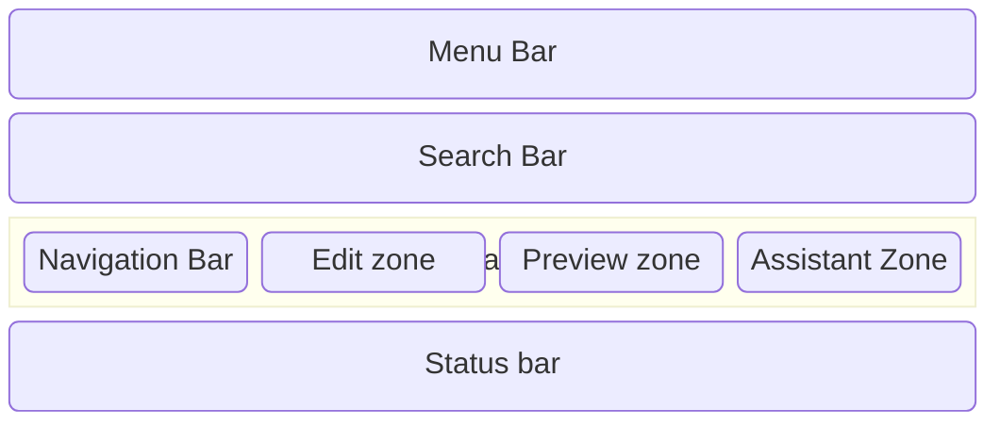
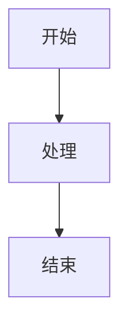
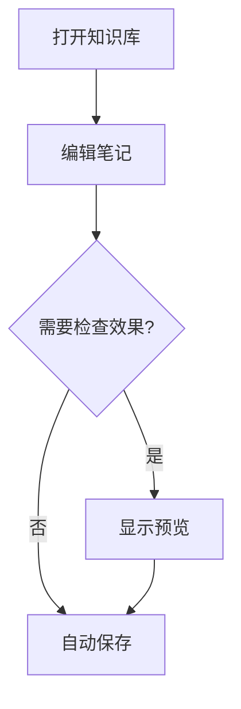
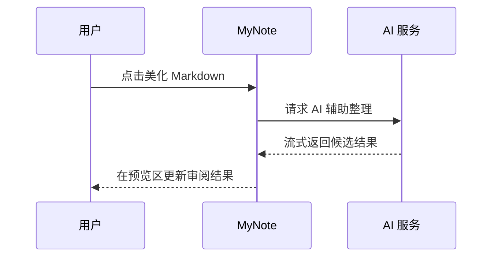
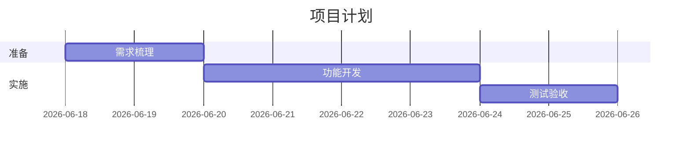
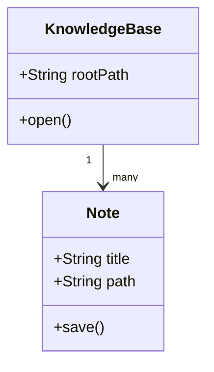
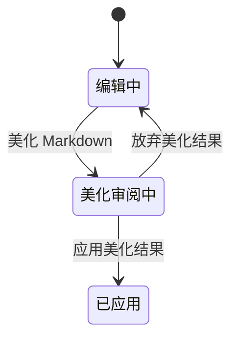

# 使用帮助 {#usage-help}

## 修订记录 {#revision-history}

| 版本 | 日期 | 说明 |
| --- | --- | --- |
| 1.4 | 2026-06-19 | 补充 `..:` 中文段首缩进语法说明，并说明仅对普通正文段落生效。 |
| 1.3 | 2026-06-18 | 补充 Emoji 简码和脚注语法支持说明。 |
| 1.2 | 2026-06-18 | 补充 Markdown 任务列表语法支持说明。 |
| 1.1 | 2026-06-18 | 补充 LaTeX 数学公式和 Mermaid 图表示例语法、使用建议、工作流和常见问题。 |
| 1.0 | 2026-06-18 | 补充 Markdown 美化、流式 AI 美化审阅、有限 HTML 标签支持的完整使用说明，并补充相关常见问题。 |
| 0.9 | 2026-06-18 | 补充 Markdown 内嵌 HTML 有限支持说明的文档入口。 |
| 0.8 | 2026-06-14 | 继续补充术语说明、首次上手顺序，以及双链、关联、手工关系和图谱分析之间的区别。 |
| 0.7 | 2026-06-14 | 继续补充菜单细项、空状态说明、标签与文件树细节，以及更完整的使用建议。 |
| 0.6 | 2026-06-14 | 继续补充搜索弹窗、最近搜索与最近命中、回看摘要卡片、预览与投影按钮等中间工作区交互说明。 |
| 0.5 | 2026-06-14 | 继续补充左侧文件/标签页签、右侧关联/图谱分析的具体使用说明与典型场景。 |
| 0.4 | 2026-06-14 | 重新充实使用帮助，补充界面布局、各区域职责、显示与隐藏方式、状态栏、搜索会话及核心工作流说明。 |
| 0.3 | 2026-06-14 | 补充复制链接与复制 Wiki 链接的快捷键、详细操作步骤，以及与右侧关联视图的关系说明。 |
| 0.2 | 2026-06-13 | 根据最新菜单结构更新说明，笔记相关操作已并入“编辑”菜单。 |
| 0.1 | 2026-06-13 | 首版使用帮助，覆盖知识库、笔记、搜索、投影与 AI 相关能力。 |

## 目录 {#table-of-contents}

1. [开始使用](#开始使用)
2. [术语说明](#glossary)
3. [界面布局](#interface-layout)
4. [管理知识库](#knowledge-base)
5. [左侧栏：文件与标签](#left-sidebar)
6. [中间工作区：编辑、预览与工具栏](#editor-workspace)
  - [Markdown 写作能力概览](#markdown-authoring-features)
  - [中文段首缩进语法](#markdown-chinese-indent)
  - [LaTeX 数学公式](#latex-formulas)
  - [Mermaid 图表](#mermaid-diagrams)
  - [Markdown 美化](#markdown-beautify)
  - [Markdown 内嵌 HTML](#markdown-embedded-html)
7. [右侧栏：大纲、关联与图谱分析](#right-sidebar)
8. [搜索与定位](#search-and-navigation)
9. [菜单与快捷键](#menus-and-shortcuts)
10. [投影预览](#projection-preview)
11. [AI 相关功能](#ai-features)
12. [状态栏与提示](#status-and-notices)
13. [常见工作流](#common-workflows)
14. [常见问题](#faq)

## 1. 开始使用

- MyNote 是一个轻量化的个人知识库应用。你可以用 Markdown 来记各种笔记。你可以在编辑的同时看到自己的成果，以不同的模式与 MyNote 进行工作，MyNote 支持**阅读模式、编辑模式及双屏一边编辑一边预览，还支持演示投影模式**，在编辑的时候把成果实时展示在另外一个大屏上，让其他人看到你的成果；如果你的笔记需要汇总，AI可以协助你进行，并且在笔记本目录中实时提示你，你已经总结过这篇笔记了；随着时间的推移你的笔记会很多，很多笔记之间会有关联，MyNote可以通过链接及双向链接来帮你整理笔记关系，用AI协助生成知识图谱。

- MyNote 的设计理念是“**让记笔记成为一件简单有成就感的事情**”，无论你是研发人员还是办公文员，只要稍加练习掌握Markdown的基本语法，你就可以掌握了把平铺的文字变成有趣的结构化展示的知识成果的能力。它的目标是成为你日常记录、整理和回看知识的得力工具，无论你是记录心情，还是整理工作笔记，还是记录会议纪要，讨论的观点、展示流程结构、演示商业计划，他都可以简单撰写，清晰有条理地展示。

- MyNote**完整支持markdown语法**，支持图片、表格、代码块等多种内容展示形式，同时支持双链和标签来帮助你建立笔记之间的连接和分类。还支持**Mermaid**图表绘制、**Latex**公式渲染。

- MyNote现在支持**跨平台**使用，Windows、MacOS、Linux都可以使用。你可以在官网下载对应平台的安装包，安装完成后直接打开应用即可。

首次使用建议按下面顺序操作：

1. 在“MyNote”菜单中选择“打开知识库”。
2. 选择一个用于保存笔记的本地目录。
3. 打开后，在左侧栏新建笔记本或笔记。
4. 在中间编辑区输入内容，根据需要决定是否显示预览。
5. 如果要建立笔记之间的连接，可以使用“复制链接”或“复制 Wiki 链接”把引用插入到其他笔记中。
6. 需要查看标题结构、关联关系或图谱分析时，可展开右侧栏查看。

如果你是第一次接触 MyNote，建议先完整浏览下面的“界面布局”章节，再开始日常使用。
布局分笔记导航区、编辑区、预览区、状态栏、搜索栏等，右侧还有可以展开的收起的辅助区。中间四个区导航区、编辑区、预览区、辅助区都可以调整大小，也可以收起。建议先把这些区域的职责和使用方式熟悉了，再开始写内容，这样会更顺畅。

如果你想用最短路径先跑通一次完整体验，建议按这个顺序：

1. 打开一个本地目录作为知识库。
2. 新建一篇笔记并输入几段文字。
3. 用“显示预览”确认 Markdown 渲染正常。
4. 再新建第二篇笔记。
5. 回到第一篇笔记，执行“复制 Wiki 链接”。
6. 把这个 Wiki 链接粘贴到第二篇笔记里。
7. 打开右侧“关联”页签，观察两篇笔记之间的连接。

这样你能一次性理解 MyNote 最核心的几件事：本地知识库、Markdown 编辑、预览、双链和关联视图。

## 2. 术语说明 {#glossary}

为了避免后面章节读起来混淆，建议先统一几个高频术语。

### 知识库 {#glossary-kb}

知识库就是你在本地打开的那个根目录。MyNote 会围绕这个目录组织笔记、图片附件、索引和关联数据。

简单理解：知识库不是一篇笔记，而是一整个工作空间。

### 笔记本 {#glossary-notebook}

笔记本更接近“目录容器”或“主题文件夹”，适合承载一个长期主题下的多篇笔记。

### 笔记 {#glossary-note}

笔记是你真正输入和阅读 Markdown 内容的基本单位。一次会议记录、一份方案草稿、一篇研究摘录，通常都对应一篇笔记。

### 标签 {#glossary-tags}

标签用于跨目录聚合同一主题内容。它不关心笔记存放在哪个笔记本里，更关心“这些内容属于同一个主题吗”。

### 链接 {#glossary-links}

这里的“链接”通常指普通路径或 Markdown 链接。它更像是把一篇笔记指向另一篇内容的引用方式。

### Wiki 链接（双链） {#glossary-wiki-links}

Wiki 链接通常形如 `[[笔记标题]]`。它适合建立笔记之间更明显、更适合知识整理的连接。

在 MyNote 里，双链是高频动作，因为它会直接影响右侧“关联”视图的可读性。

### 关联 {#glossary-backlinks}

关联是右侧栏里用来查看“当前笔记与其他笔记之间连接情况”的区域。它会帮助你看见：

1. 当前笔记链接到了谁。
2. 谁又反过来提到了当前笔记。
3. 哪些连接已经形成了可回看的网络。

### 手工关系 {#glossary-manual-relations}

手工关系不是把链接直接写进正文，而是通过右侧关系面板显式维护一条关系，例如“相关”“前置”“扩展”“支持”“对立”。

它更适合你已经明确知道两篇笔记之间存在什么逻辑关系，并希望把这种关系结构化保留下来。

### 图谱分析 {#glossary-graph-analysis}

图谱分析是在更高层看当前笔记在整体知识网络中的位置。它不是单纯告诉你“有没有链接”，而是帮助你从网络角度理解结构。

### 回看摘要 {#glossary-lookback-summary}

回看摘要是给未来自己准备的一段快速理解说明。它通常比正文更短，目的是让你以后重新打开笔记时，几秒内就能想起这篇内容为什么重要。

## 3. 界面布局 {#interface-layout}

MyNote 的主界面可以理解为“上方标题栏 + 中间主工作区 + 下方状态栏”的结构。其中，中间主工作区又由左侧栏、中间编辑区和右侧栏三部分组成。

### 顶部菜单栏 {#top-bar}

顶部栏位于窗口最上方，主要承担两个作用：

1. 显示当前知识库名称。未打开知识库时，这里通常显示 MyNote。
2. 在已打开知识库时，右上角提供搜索按钮，可快速打开全局搜索。

你可以把顶部栏理解为“当前工作空间的抬头区”。它本身不负责编辑内容，但能帮助你确认现在正在操作哪个知识库。

如果顶部栏只显示 MyNote 而没有知识库名称，通常意味着：

1. 你还没有打开任何知识库。
2. 或者你刚刚关闭了知识库，当前处于空工作区状态。

### 导航栏 {#left-pane-layout}

导航栏用于组织和浏览知识库内容，可以新建笔记本、笔记，管理笔记及目录相关设置。顶部有两个页签：

1. “文件”：用于查看笔记本与笔记树。这个区域通常是隐藏的，鼠标移动到这个区域时会展开显示，离开后会自动收起。主要有三个按钮：
   - 新建笔记本：创建一个新的笔记本。
   - 新建笔记：在当前选中的笔记本下创建一篇新的笔记。
   - 导入笔记：从外部 Markdown 文件导入到当前知识库。
2. “标签”：用于查看标签列表和标签上下文。这里标签可以通过人工添加，系统也会自动搜索出现有笔记中的标签，点击标签可以查看相关笔记。

左侧栏和中间编辑区之间有一个可拖动的分隔条：

1. 你可以拖动分隔条调整左侧栏宽度。
2. 分隔条上的折叠按钮可以收起或重新展开左侧栏。

### 中间工作区 {#center-pane-layout}

中间工作区分两块，左侧是编辑区右侧是预览区，整个中间工作区上部是功能按钮，控制编辑阅读模式切换以及文章的摘要生成删除，在工作区的最上面还有搜索栏，你可以点击搜索图标后进行全库搜索。主要包含：

1. 当前笔记标题与工作状态条。
2. 编辑器。
3. 预览区。
4. 搜索会话条（仅在使用搜索结果定位时出现），提供搜索历史回顾及删除功能。

如果当前没有打开任何笔记，中间区域会提示你先从左侧选择或新建笔记。

### 右侧辅助栏 {#right-pane-layout}

右侧栏主要用于辅助理解当前笔记，默认是收起的，你可以点击侧边的按钮展开它。它包含三个页签：

1. 大纲：查看当前笔记的标题结构。
2. 关联：查看当前笔记的链接、回链和显式关系。
3. 图谱分析：查看当前笔记在知识网络中的分析结果。

右侧栏同样可以：

1. 通过分隔条拖动调整宽度。
2. 通过折叠按钮收起或重新展开。

### 状态栏 {#bottom-status-bar}

状态栏位于窗口最底部，用于展示当前工作状态。打开笔记后，通常会看到：

1. 当前笔记路径。
2. 当前字数统计。
3. 保存状态或操作提示。
4. 索引刷新提示。
5. 其他即时反馈，例如复制链接成功提示。

当你执行“复制链接”“复制 Wiki 链接”等动作时，状态栏也会给出即时反馈。

## 4. 管理知识库 {#knowledge-base}

知识库是 MyNote 的工作根目录。打开知识库后，应用会把该目录下的笔记、附件和索引一起作为当前工作空间。

常用操作包括：

1. 打开知识库：从“MyNote”菜单选择“打开知识库”。
2. 关闭知识库：从“MyNote”菜单选择“关闭知识库”。
3. 导入笔记：从“MyNote”菜单选择“导入笔记”，将已有 Markdown 笔记纳入当前知识库。

关于知识库，你需要理解两点：

1. 知识库本质上是一个本地目录，MyNote 不会把它变成云端文档系统。
2. 你看到的笔记、附件、图片和索引，都围绕这个目录组织。

建议：

1. 为一个主题或长期项目维护单独知识库，避免单个目录过大。
2. 定期备份知识库目录，尤其是附件与图片资源。

关闭知识库后，依赖当前知识库的界面内容会一起清空，例如当前笔记、搜索上下文、部分侧栏内容和帮助弹窗状态，这属于正常行为。

## 5. 左侧栏：文件与标签 {#left-sidebar}

左侧栏是进入内容的主要入口。大多数日常操作，都是先从这里选择对象，再到中间工作区继续处理。

### 文件页签 {#files-tab}

“文件”页签展示知识库中的笔记本与笔记结构。

你可以在这里执行：

1. 新建笔记本。
2. 新建笔记。
3. 导入笔记。
4. 选择并打开某篇笔记。
5. 调整笔记在知识库中的组织结构。

通常的使用方式是：

1. 先在文件树中定位一个笔记本。
2. 再选择其中某篇笔记。
3. 选中后，中间工作区会载入这篇笔记。

文件页签里建议重点理解下面几件事：

1. 笔记本更适合承担“长期主题”的组织作用，例如工作、项目、课程、研究方向。
2. 笔记适合承担“具体内容单元”，例如一次会议纪要、一篇调研、一份提纲。
3. 当文件树内容较多时，先确定笔记属于哪个笔记本，再展开对应分支，会比在所有笔记里逐个找更快。

在文件页签中，日常最常见的几类动作是：

1. 新建笔记本：当你准备开始一个新主题时使用。
2. 新建笔记：当你已经有主题容器，只需要继续写内容时使用。
3. 导入笔记：当你已经有外部 Markdown 文件，需要纳入当前知识库时使用。
4. 重命名：当标题或分类命名不再准确时使用。
5. 移动：当笔记原本放错位置，或主题边界发生变化时使用。
6. 删除：当内容确定不再需要，或者已经迁移到其他笔记时使用。

文件树里的实际观察顺序通常是：

1. 先看有哪些笔记本。
2. 再展开某个笔记本看里面有哪些笔记。
3. 选中一篇笔记后，中间区域载入正文，右侧辅助面板也会开始围绕这篇笔记工作。

如果你在文件页签中什么都看不到，常见原因包括：

1. 当前知识库里还没有内容。
2. 你正在标签筛选上下文中，当前显示的是筛选后的结果。
3. 你刚打开了一个空目录作为知识库。

如果你更关注“写作效率”而不是“目录管理”，建议先把左侧文件树收拾到大致可用即可，不必一开始就追求非常复杂的层级。

### 标签页签 {#tags-tab}

“标签”页签用于按标签浏览知识内容。

你可以在这里：

1. 查看知识库中的标签列表。
2. 筛选某个标签相关的笔记。
3. 查看标签上下文中的笔记条目。
4. 打开标签对应的笔记并定位到相关内容。

如果你经常通过主题、项目、任务或概念来整理笔记，标签页签会比文件树更适合横向浏览。

标签页签更适合下面这些场景：

1. 你已经写了很多分散在不同笔记本里的内容，但它们属于同一个概念，例如“合同风险”“年度复盘”“阅读摘录”。
2. 你想快速看到某个标签关联的几篇核心笔记，而不是按文件夹层级去翻找。
3. 你在整理知识时，想先从“主题集合”而不是“存放位置”切入。

标签页签中的常见使用方式：

1. 点击一个标签后，可以看到与该标签相关的上下文内容。
2. 再点击标签上下文中的某一条结果，可以直接打开对应笔记并定位到相关位置。
3. 如果你想在当前笔记继续添加标签，可以在标签面板中新增标签。

需要注意：

1. 新增标签通常依赖当前已经打开了一篇笔记。
2. 删除标签会影响相关笔记中的标签使用，因此更适合在你确认不再需要这个标签时再操作。
3. 如果标签很多，先用一两个主标签建立稳定习惯，通常比一开始就堆很多细标签更容易维护。

简单理解：

1. 文件页签偏“这篇内容放在哪”。
2. 标签页签偏“这篇内容属于什么主题”。

### 左侧栏的隐藏与展开 {#left-sidebar-visibility}

如果你希望获得更大的编辑空间：

1. 可以收起左侧栏，让中间工作区更宽。
2. 需要切换笔记时，再重新展开左侧栏即可。

收起左侧栏不会删除任何内容，只是临时隐藏这一块界面。

## 6. 中间工作区：编辑、预览与工具栏 {#editor-workspace}

中间工作区是你真正写笔记、看预览、触发摘要、切换投影和管理搜索会话的地方。

### 当前笔记栏 {#current-note-toolbar}

打开笔记后，中间工作区上方会显示一条工作条。这里通常包含：

1. 当前笔记标题。
2. 可能出现的加载提示。
3. 投影相关提示或错误提示。
4. 摘要状态或错误提示。
5. 右侧的操作按钮。

右侧常用按钮包括：

1. 展开摘要 / 隐藏摘要。
2. 开启投影 / 关闭投影。
3. 显示预览 / 隐藏预览。

这三个按钮可以理解为“当前笔记层面的工作模式切换器”：

1. 展开摘要：查看或编辑当前笔记的回看摘要。
2. 开启投影：把当前内容投到单独的只读窗口，用于展示，你可以在进行讨论时将要讨论的内容通过投影窗口展示给他人。
3. 显示预览：在当前窗口内同时查看 Markdown 渲染效果。

如果你只是专注写作，通常会优先保留编辑器；如果你要检查结构、排版或展示效果，就会更频繁使用预览和投影按钮。

如果当前没有打开任何笔记，这一整块工作条通常不会进入完整工作状态，中间区域也会提示你先从左侧选择或新建笔记。

### 编辑器 {#markdown-editor}

编辑器是输入 Markdown 正文的主要区域，现在支持常用 Markdown 语法，还增加了 Mermaid 图表、LaTeX 数学公式、有限 HTML 标签和 Markdown 美化能力。

- 现在支持的 Mermaid 版本是 11.15.0，包括流程图、时序图、甘特图、类图、状态图、实体关系图等这个版本支持的主要图表类型。
- 支持的数学公式包括行内公式和行间公式两种形式，预览区会使用 KaTeX 渲染。

- 每个新建的笔记都会自动生成meta信息，包含创建时间、修改时间、字数统计等，这些信息会在编辑器上方以状态条的形式展示，但不会在预览区显示。

你可以在这里完成：

1. 输入普通文本。
2. 插入 Markdown 链接。
3. 粘贴图片。
4. 粘贴文本或其他引用内容。
5. 使用双链来组织笔记之间的关系。

编辑器会配合自动保存和索引刷新工作，所以在你修改内容后，状态栏和右侧相关区域可能会在短时间内更新。

### Markdown 写作能力概览 {#markdown-authoring-features}

MyNote 的编辑和预览围绕 Markdown 展开。日常写作时，你可以优先使用 Markdown 原生语法完成大多数结构化表达：

1. 标题：使用 `#`、`##`、`###` 等组织层级。
2. 段落与引用：使用空行分段，使用 `>` 书写引用块。
3. 列表：使用 `-`、`*` 或数字列表整理步骤。
4. 任务列表：使用 `- [ ]` 表示待办，使用 `- [x]` 或 `- [X]` 表示已完成。
5. 表格：使用 Markdown 表格语法展示结构化信息。
6. 代码：使用行内反引号或围栏代码块展示代码、配置和命令。
7. 图片：优先使用 ``，粘贴图片时 MyNote 会自动保存附件并插入引用。
8. 链接和双链：使用 Markdown 链接或 Wiki 链接连接其它笔记。
9. Emoji 简码：使用 `:joy:`、`:smile:`、`:rocket:` 这类简码插入常见表情。
10. 脚注：使用 `[^1]` 和对应脚注定义补充说明、来源或注释。
11. Mermaid：使用 `mermaid` 围栏代码块绘制图表。
12. LaTeX：使用 `$...$` 写行内公式，使用 `$$...$$` 写行间公式。
13. 有限 HTML：在少量 Markdown 不方便表达的排版场景中使用白名单 HTML 标签。
14. 中文段首缩进：使用 `..:` 标记某一个普通正文段落，让预览区按两个字宽做首行缩进。

如果你不确定某段内容该用 Markdown 还是 HTML，建议优先使用 Markdown。HTML 只适合补充下标、上标、键盘按键、高亮、折叠说明和少量图片标签等场景。

任务列表示例：

```md
- [ ] 整理会议记录
- [x] 完成公式校对
- [X] 输出发布说明
```

预览区会将任务列表渲染为只读复选框，便于阅读和审阅当前完成状态。

Emoji 简码示例：

```md
今天状态不错 :joy:
发布版本前记得检查 :rocket:
```

脚注示例：

```md
这里有一个脚注引用。[^1]

[^1]: 这是脚注内容。
```

预览区会把 Emoji 简码转换成对应表情，把脚注引用渲染为编号，并在文末显示脚注内容与回跳链接。

### 中文段首缩进语法 {#markdown-chinese-indent}

如果你希望某一个中文段落在预览时首行缩进两个字宽，可以在该段落首行开头写 `..:`。

示例：

```md
..: 这是一个需要首行缩进的段落。
这仍然属于同一个段落，因此会继续保留这个段落的缩进效果。

这是一个普通段落，不会缩进。

..: 这是另一个需要缩进的段落。
```

使用规则：

1. `..:` 只对当前这个普通正文段落生效，不会自动影响后面的其它段落。
2. 同一个段落里的后续换行仍然属于这个缩进段落。
3. 预览区会隐藏 `..:` 标记本身，只保留缩进效果。
4. 这个语法只对普通正文段落生效，不会在列表项、引用块等嵌套结构中触发。
5. 如果另一个段落也需要缩进，就在那个段落首行再次写一次 `..:`。

编辑器中会对 `..:` 做轻量提示，帮助你识别哪些段落被标记为中文首行缩进。

### LaTeX 数学公式 {#latex-formulas}

MyNote 支持在 Markdown 中书写 LaTeX 数学公式，适合记录数学推导、统计公式、算法说明、金融因子表达式和技术笔记。公式会在预览区渲染，编辑器中仍保留原始 Markdown 文本。

常用写法有两种：行内公式和行间公式。

#### 行内公式 {#latex-inline-formulas}

行内公式使用一对 `$` 包裹，适合放在普通句子中。

```md
质能方程 $E = mc^2$ 很重要。
```

预览时，`$E = mc^2$` 会显示为数学公式，并和正文在同一行。

#### 行间公式 {#latex-block-formulas}

行间公式使用 `$$` 独占行包裹，适合较长公式、积分、矩阵或推导步骤。

```md
积分公式：

$$
\int_0^1 x^2 \, dx = \frac{1}{3}
$$
```

矩阵也可以这样写：

```md
$$
\begin{pmatrix}
a & b \\
c & d
\end{pmatrix}
$$
```

#### 常用公式示例 {#latex-common-examples}

```md
平方根：$\sqrt{x}$

分数：$\frac{a}{b}$

求和：$\sum_{i=1}^{n} i$

希腊字母：$\alpha, \beta, \gamma$

上下标：$x_i^2$
```

使用建议：

1. 行内公式适合短表达式；复杂公式尽量使用行间公式。
2. 行间公式的开始 `$$` 和结束 `$$` 建议单独成行。
3. 如果公式没有渲染，先检查 `$` 或 `$$` 是否成对闭合。
4. 如果正文里只是普通美元符号，建议用反斜杠转义，或放进行内代码里，例如 `` `$price` ``。
5. LaTeX 渲染依赖 KaTeX，少数特别复杂或 KaTeX 不支持的命令可能不会按预期显示。

### Mermaid 图表 {#mermaid-diagrams}

MyNote 支持在 Markdown 中通过 Mermaid 绘制图表。图表使用围栏代码块书写，语言标记必须写成 `mermaid`。

基本格式如下：

````md

````

预览区会把这段 Mermaid 代码渲染成图表。如果渲染失败，预览区会显示“Mermaid 渲染失败”，并保留原始 Mermaid 源码，方便你检查语法。

#### 流程图 {#mermaid-flowchart}

````md

````

#### 时序图 {#mermaid-sequence}

````md

````

#### 甘特图 {#mermaid-gantt}

````md

````

#### 类图 {#mermaid-class}

````md

````

#### 状态图 {#mermaid-state}

````md

````

使用建议：

1. Mermaid 代码块必须以 ```` ```mermaid ```` 开始，以 ```` ``` ```` 结束。
2. 图表语法对缩进、箭头和节点标记比较敏感，渲染失败时先检查这些位置。
3. 图表内容较长时，建议先从一个最小可渲染版本开始，再逐步添加节点和关系。
4. Mermaid 图表适合表达流程、时序、状态、依赖和项目计划；普通表格数据仍建议用 Markdown 表格。
5. MyNote 会在渲染 Mermaid SVG 前做安全清理，脚本等危险内容不会进入预览区执行。

### Markdown 美化 {#markdown-beautify}

“美化 Markdown”用于把当前笔记整理成更规范、更容易阅读的 Markdown。它适合处理从网页、AI、聊天记录或旧文档中粘贴来的内容，也适合在一篇长笔记写完后统一检查排版。

常见可整理内容包括：

1. 标题格式，例如修正标题符号和标题文字之间的空格。
2. 空行和段落间距，让正文、标题、代码块之间更清楚。
3. 围栏代码块，尽量保持代码块开始和结束标记匹配。
4. 目录区域，在开启目录刷新时补充或更新目录结构。
5. 明显多余的 Markdown 转义，例如把被反斜杠包住的行内代码还原为正常的反引号代码样式。
6. 明显的变量或公式片段，例如把 `\$close` 这类内容整理成更适合阅读的代码样式。
7. 某些没有分开的说明段落，例如把连续粘在一起的“解析”“系列文章”等内容整理得更清楚。

使用步骤：

1. 打开一篇笔记。
2. 点击当前笔记栏右侧的“美化 Markdown”。
3. 如果只想使用本地规则整理，直接点击“确认美化”。
4. 如果希望 AI 参与更复杂的格式整理，勾选“使用 AI 辅助格式整理”，再点击“确认美化”。
5. 美化开始后，右侧预览区会显示审阅结果。开启 AI 辅助时，预览区会流式展示中间生成过程，不需要等到全部完成才看到结果。
6. 审阅条中可以点击“查看改动”查看差异，也可以点击“恢复预览”回到普通预览。
7. 确认结果可用后，点击“应用美化结果”。如果不满意，点击“放弃美化结果”。

美化过程不会直接覆盖正文，而是先进入审阅状态。你需要主动点击“应用美化结果”，整理后的内容才会进入编辑器并参与后续保存。

当 AI 正在流式美化时，“应用美化结果”会显示为“等待 AI 完成”并暂时不可点击。这是为了避免在 AI 还没有返回完整候选结果时提前应用半成品。

如果 AI 不可用、认证失败、网络异常或候选结果不完整，MyNote 会保留本地规则整理结果，并在审阅条中说明 AI 未生效原因。遇到这种情况时，你仍然可以查看本地规则整理后的结果，再决定是否应用。

建议使用方式：

1. 对重要笔记，先查看改动再应用，避免误接受不符合预期的格式变化。
2. 对公式、代码、表格较多的笔记，重点检查代码块边界和公式显示效果。
3. AI 辅助更适合处理粘贴来源复杂、段落明显混乱的内容；普通空行、标题和代码块问题通常本地规则就足够。
4. 如果美化后仍有少量不满意的地方，可以应用结果后再手动微调。

### Markdown 内嵌 HTML {#markdown-embedded-html}

MyNote 支持有限的 Markdown 内嵌 HTML，用于补足 Markdown 原生语法不方便表达的轻量排版。支持范围是白名单式的：只允许指定标签，其它原生 HTML 标签会被移除。

当前支持的原生 HTML 标签包括：

| 分类 | 标签 | 用途 |
| --- | --- | --- |
| 基础排版 | `<br>` | 手动换行。 |
| 基础排版 | `<hr>` | 分隔线。 |
| 基础排版 | `<sub>` | 下标。 |
| 基础排版 | `<sup>` | 上标。 |
| 基础排版 | `<kbd>` | 键盘按键。 |
| 基础排版 | `<mark>` | 高亮标记。 |
| 基础排版 | `<abbr>` | 缩写说明。 |
| 文本容器 | `<span>` | 行内文本容器。 |
| 文本容器 | `<p>` | HTML 段落。 |
| 折叠内容 | `<details>` | 可展开或收起的内容区域。 |
| 折叠内容 | `<summary>` | 折叠内容标题。 |
| 图片 | `` | 插入图片。 |

常见用法示例：

```md
水是 H<sub>2</sub>O，平方可以写成 x<sup>2</sup>。

使用 <kbd>Cmd</kbd> + <kbd>K</kbd> 打开搜索。

这个结论需要 <mark>下次优先回看</mark>。

<details>
<summary>展开查看背景说明</summary>

这里是补充说明。

</details>
```

属性限制：

1. `<abbr>` 只保留 `title`。
2. `<details>` 只保留 `open`。
3. `` 只保留 `src`、`alt`、`title`，并且 `src` 必须是安全来源。
4. `<p>` 和 `<span>` 只保留 `title`。
5. `<br>`、`<hr>`、`<kbd>`、`<mark>`、`<sub>`、`<summary>`、`<sup>` 不保留额外属性。
6. `style`、`class`、`id`、`onclick`、`onerror` 等属性都不支持。

`` 的 `src` 允许 `http://`、`https://`、`notes/...`、`assets/...`、根路径 `/...` 和图片 `data:` URL。其它来源会被删除。

禁止的原生 HTML 包括但不限于 `<script>`、`<iframe>`、`<object>`、`<embed>`、`<video>`、`<audio>`、`<table>`、`<div>`、`<style>`、`<link>`、`<meta>`。如果需要表格、列表、代码块，建议使用 Markdown 原生语法，而不是 HTML 标签。

代码块里的 HTML 不会被解析，会按代码显示。块级 HTML 建议和前后正文保留空行，避免和普通段落混在一起。

更完整的标签白名单、属性限制和示例请查看 [Markdown 内嵌 HTML 支持说明](markdown-embedded-html-support.md)。

### 预览区 {#preview-pane}

预览区用于查看当前 Markdown 的渲染效果。

你可以这样理解预览区：

1. 它是只读视图，适合检查排版、图片、链接和结构。
2. 在分栏模式下，它和编辑器并排显示。
3. 在只想专注写作时，可以隐藏预览区。

如果当前笔记内容很大，预览区可能会短暂显示“正在加载预览...”，这是为了避免大文档影响编辑体验。

预览区也会承担 Markdown 美化审阅：当你执行“美化 Markdown”后，右侧预览会先显示整理后的候选结果。开启 AI 辅助时，预览区会随着 AI 返回内容持续更新，便于你看到中间过程和最后结果。

### 搜索会话条 {#search-session-bar}

当你通过全局搜索打开一篇笔记后，中间工作区底部可能会出现“搜索会话”状态条。

它的作用是：

1. 告诉你当前正在浏览哪一个搜索词的命中结果。
2. 显示当前位置是第几条命中。
3. 允许你在上一条和下一条命中之间切换。
4. 允许你退出这次搜索会话。

这意味着，全局搜索不仅能“打开一篇笔记”，还能在一组搜索结果中连续跳转。

搜索会话条适合的典型场景：

1. 你在多篇笔记里追一个关键词，想按命中顺序连续看下去。
2. 你已经定位到一个结果，但还想顺手检查前后其他命中。
3. 你想在阅读过程中保留“当前这次搜索的上下文”，而不是每次都重新回到搜索弹窗输入关键词。

如果你觉得底部这条栏暂时打扰阅读，可以直接退出搜索会话；退出后只是结束这次连续导航，不会关闭当前笔记。

### 回看摘要卡片 {#lookback-summary-card}

当你点击“展开摘要”后，中间工作区会出现一张回看摘要卡片。

它主要用于帮助你为当前笔记整理一段更适合后续回看的摘要内容。你可以把它理解为“给未来的自己写一段快速理解说明”。

这张卡片通常包含几类操作：

1. 查看已保存摘要。
2. 编辑摘要。
3. 生成摘要或重新生成摘要。
4. 保存摘要。
5. 删除摘要。

建议使用方式：

1. 当一篇笔记已经基本写完时，再整理摘要会更有效。
2. 如果你对 AI 生成结果不完全满意，可以先生成，再手动修改后保存。
3. 对长期需要回看的笔记，例如项目总结、专题研究、会议结论，摘要价值通常很高。

如果你还没决定一篇笔记是否值得沉淀摘要，也可以暂时不保存，等内容稳定后再处理。

如果你展开摘要后看到：

1. 没有已保存摘要：说明这篇笔记还没有正式沉淀过摘要。
2. 只有候选内容：说明你正在编辑或准备保存摘要。
3. 生成中或保存中：说明系统正在处理当前摘要操作，建议稍等完成后再继续下一步。

### 常见编辑动作 {#editing-actions}

编辑相关说明：

1. 直接粘贴普通文本时，会按文本内容插入。
2. 从网页或剪贴板粘贴图片时，应用会将图片保存到本地附件目录，并在笔记中插入对应 Markdown 图片引用。
3. 分栏模式下，可以同时查看编辑内容与预览结果。
4. 仅编辑器模式下，会让写作区域更专注。
5. 需要对当前笔记执行重命名、移动、复制链接或删除时，可直接使用“编辑”菜单。
6. 如果你正在整理知识网络，建议优先使用“复制 Wiki 链接”，这样在后续查看右侧“关联”信息时会更直观。

如果你看到预览内容与编辑器内容不一致，通常是因为笔记尚未完成保存或索引仍在刷新，等待片刻后再查看即可。

## 7. 右侧栏：大纲、关联与图谱分析 {#right-sidebar}

右侧栏主要是“理解当前笔记”的地方，而不是“输入正文”的地方。

### 大纲 {#outline-panel}

“大纲”页签会根据当前笔记中的标题自动生成结构。

适合用在：

1. 长文快速跳转。
2. 检查标题层级是否合理。
3. 在写作过程中定位某一节内容。

如果当前笔记没有可识别的标题，大纲区域会提示当前没有可用标题。

大纲的实用价值主要体现在：

1. 长笔记快速跳转。特别是会议纪要、方案、研究笔记这种多标题内容。
2. 写作时检查结构是否平衡。例如某些部分是否只有标题没有正文，或者层级过深。
3. 回看旧笔记时，先理解结构，再决定是否需要细读正文。

### 关联 {#associations-panel}

“关联”页签用于查看当前笔记与其他笔记、链接和关系之间的连接。

它通常会帮助你看到：

1. 当前笔记指向了哪些内容。
2. 哪些内容反向提到了当前笔记。
3. 已建立的显式关系。

这也是“复制 Wiki 链接”特别重要的原因之一：

1. 你把一篇笔记的 Wiki 链接粘贴到另一篇笔记后，通常会逐步形成更清晰的关联网络。
2. 后续回看时，可以在这里更直观地理解这些关联。

建议你把“关联”页签理解成一张“当前笔记和其他内容之间的来往记录”。

它特别适合这些高频场景：

1. 你想知道这篇笔记引用了哪些别的笔记。
2. 你想反过来查看，哪些内容提到了当前笔记。
3. 你已经通过双链或显式关系建立了连接，想集中检查这些连接是否完整。

当你日常使用“复制 Wiki 链接”时，右侧“关联”页签通常会越来越有价值，因为它会帮助你从单篇笔记视角看见更大的知识网络。

除了正文里的普通链接和 Wiki 链接，这里还可能出现手工维护的显式关系。你可以把它们理解成两类不同的连接方式：

1. 正文链接或 Wiki 链接：更自然地出现在笔记内容里，适合边写边建立连接。
2. 手工关系：更结构化，适合在你已经清楚两篇笔记逻辑关系时单独标注。

如果你只是日常记录和整理，通常先用 Wiki 链接就足够了；如果你在做专题研究、知识建模或复杂问题拆解，再逐步补手工关系会更有价值。

### 手工关系面板 {#manual-relations-panel}

在关联相关区域中，你还可以维护显式关系。常见关系类型包括：

1. 相关。
2. 前置。
3. 扩展。
4. 对立。
5. 支持。
6. 相似。

这类关系适合下面的情况：

1. 你希望区分“只是提到”与“真正存在逻辑依赖”。
2. 你在梳理方案、知识点、论据或结论时，需要更明确的关系类型。
3. 你不想把所有关系都塞进正文里，而是希望额外维护一层结构化语义。

建议顺序通常是：

1. 先通过正文和 Wiki 链接把基础连接建立起来。
2. 再对特别重要的连接补上手工关系类型。

### 图谱分析 {#graph-analysis-panel}

“图谱分析”页签适合在知识网络逐渐复杂后使用。

它更偏向分析与洞察，而不是日常的快速编辑。你可以把它理解为对当前笔记在整体知识结构中位置的一种辅助观察视图。

如果你是第一次接触这个区域，可以这样理解它：

1. “大纲”关注的是一篇笔记内部的结构。
2. “关联”关注的是当前笔记和其他笔记之间已经形成的连接。
3. “图谱分析”则更像是在问：当前笔记在整个知识网络里扮演什么角色，还有哪些潜在关系值得关注。

图谱分析更适合这些情况：

1. 你已经有一批彼此相关的笔记，想找出上下游关系、支持关系或冲突关系。
2. 你在做项目梳理、专题研究、复杂问题拆解，希望从更高层看知识结构。
3. 你不只是想“记下来”，而是想逐步把笔记整理成能推理、能回看的网络。

如果你只是刚开始记笔记，可以先不用频繁查看图谱分析；但当内容越来越多时，它会比单纯翻目录更有帮助。

### 右侧栏的隐藏与展开 {#right-sidebar-visibility}

如果你暂时只想专注于写作：

1. 可以先收起右侧栏。
2. 需要查看大纲、关联或图谱时再展开。

这不会影响笔记内容，只是调整界面空间分配。

## 8. 搜索与定位 {#search-and-navigation}

点击顶部搜索按钮，或使用快捷键打开搜索弹窗，可以快速查找整个知识库中的内容。

搜索支持：

1. 输入关键词后查看匹配结果。
2. 使用上下方向键切换结果。
3. 按回车打开当前结果。
4. 通过搜索历史快速重复常用查询。

当搜索框为空时，搜索弹窗不只是空白面板，通常还会显示两类历史信息：

1. 最近搜索：你之前输入过的关键词。
2. 最近查看命中：你最近从搜索结果里打开过的具体命中项。

这意味着搜索弹窗本身也可以作为“最近回看入口”使用，而不只是临时查找工具。

搜索结果打开后，MyNote 不只是“跳到一篇笔记”，还会尽量把你带到相关位置。因此你会经常看到：

1. 中间工作区底部出现搜索会话条。
2. 你可以沿着同一次搜索继续看上一条或下一条命中。
3. 按退出后，当前搜索会话结束，但笔记仍会保留在当前打开状态。

搜索更高效的做法：

1. 优先使用具体标题、关键术语或标签名称。
2. 如果结果较多，可以缩短范围后再次搜索。
3. 打开结果后，结合预览和上下文继续定位内容。

如果搜索框为空，你还可能看到最近搜索和最近查看命中记录，便于重复打开常用内容。

### 如何理解搜索结果 {#search-result-interpretation}

搜索结果通常会显示以下信息：

1. 笔记标题。
2. 命中来源，例如标题命中、正文命中或链接命中。
3. 命中片段。
4. 笔记路径。
5. 某些情况下还会显示回看摘要。

如果结果是“链接命中”，你有时还会看到“打开目标”操作。这适合你在搜索某个链接关系时，直接跳到该链接对应的目标内容。

简单判断方式：

1. 想看当前命中出现在哪篇笔记里，就点结果本身。
2. 想直接去看链接指向的目标，就用“打开目标”。

如果你只是想继续沿着最近的搜索线索往下看，也可以不重新输入，而是直接利用“最近搜索”或“最近查看命中”快速恢复上下文。

## 9. 菜单与快捷键 {#menus-and-shortcuts}

MyNote 的功能入口主要分布在“MyNote”“编辑”“视图”“帮助”四个顶层菜单中。

### MyNote 菜单 {#mynote-menu}

主要负责知识库和全局功能，例如：

1. 新建笔记。
2. 新建笔记本。
3. 打开知识库。
4. 关闭知识库。
5. 导入笔记。
6. AI 设置相关功能。

可以把 MyNote 菜单理解为“整个知识库级别的入口”，也就是不依赖某一篇当前笔记就能执行的大部分操作。

更具体地说：

1. 当你还没开始写内容、只是想准备工作环境时，通常先用 MyNote 菜单。
2. 当你要处理某篇已经打开的笔记时，通常更多会用编辑菜单。

### 编辑菜单 {#edit-menu}

“编辑”菜单主要承担当前笔记相关操作。

其中最常用的包括：

1. 重命名。
2. 移动。
3. 复制链接。
4. 复制 Wiki 链接。
5. 删除笔记。
6. 撤销。
7. 重做。

编辑菜单里的很多动作都依赖“当前笔记”存在，所以如果你没有先打开一篇笔记，部分菜单项会显示为不可用。

高频链接操作说明：

1. 复制链接：先打开或选中要被引用的那篇笔记，再执行“编辑 -> 复制链接”或使用快捷键 `⌘L`。
2. 执行“复制链接”后，复制到剪贴板的是当前笔记的路径文本，例如 `notes/current.md`。
3. 复制完成后，不需要先点目标位置；你可以切换到任意笔记或其他应用，再把光标放到需要插入的位置后执行粘贴。
4. 如果你希望在另一篇笔记中保留一条可追溯的笔记引用，但不要求使用双链语法，可以优先使用“复制链接”。
5. 复制 Wiki 链接：先打开或选中要被引用的那篇笔记，再执行“编辑 -> 复制 Wiki 链接”或使用快捷键 `⌘⇧W`。
6. 执行“复制 Wiki 链接”后，复制到剪贴板的是双链文本，例如 `[[会议纪要]]`。
7. 复制 Wiki 链接后，通常会把它粘贴到另一篇笔记的正文中，用来建立笔记之间的显式关联。
8. 双链建立后，可以在右侧隐藏侧栏中的“关联”区域查看相关关系，因此这是非常高频的整理动作。
9. 如果“复制链接”或“复制 Wiki 链接”菜单是灰色的，通常表示当前还没有打开任何笔记，需要先选中一篇笔记。

### 视图菜单 {#view-menu}

“视图”菜单主要负责界面显示与投影相关功能，例如：

1. 搜索。
2. 显示或隐藏左侧栏。
3. 显示或隐藏右侧栏。
4. 仅编辑器模式。
5. 分栏编辑模式。
6. 开启或关闭投影预览。
7. 投影窗口跟随滚动。

视图菜单适合解决两类问题：

1. 我现在想怎么看这篇笔记。
2. 我现在想给界面腾出多少空间。

如果你不确定应该用“仅编辑器”还是“分栏编辑”，可以这样选择：

1. 长时间写作、做初稿时，更适合仅编辑器。
2. 检查 Markdown 排版、图片、链接和结构时，更适合分栏编辑。

### 帮助菜单 {#help-menu}

“帮助”菜单中提供：

1. 快捷键。
2. 使用帮助。
3. 关于 MyNote。

如果你在使用中遇到“我知道有这个功能，但不记得入口在哪里”的情况，先看帮助菜单通常最省时间。

### 快捷键 {#shortcuts}

当前常用快捷操作包括：

1. 搜索：`⌘K`
2. 关闭当前弹窗：`Esc`
3. 粘贴文本或图片：`⌘V`
4. 复制当前笔记链接：`⌘L`
5. 复制当前笔记 Wiki 链接：`⌘⇧W`
6. 搜索结果中切换上一项或下一项：方向键 `↑` / `↓`
7. 打开当前搜索命中：`Enter`

更多快捷键信息可在“帮助”菜单中的“快捷键”查看。

## 10. 投影预览 {#projection-preview}

投影预览适合会议展示、演讲或第二屏阅读。开启后，主窗口仍可继续编辑，投影窗口则显示只读预览内容。

相关操作：

1. 在“视图”菜单中选择“开启投影预览”。
2. 需要结束展示时，选择“关闭投影预览”。
3. 如果希望投影窗口跟随当前阅读位置，可启用“投影窗口跟随滚动”。

投影与普通预览的区别可以这样理解：

1. 普通预览是在主窗口内部查看渲染效果。
2. 投影预览是在单独窗口中查看只读展示效果。

因此：

1. 如果你只是想边写边看排版，优先用“显示预览”。
2. 如果你要拿去展示、分享或双屏讲解，优先用“开启投影”。

适用场景：

1. 一边讲解，一边在主屏修订内容。
2. 将副屏作为纯净阅读视图，避免编辑器界面干扰。

开启后你需要注意：

1. 投影窗口是只读预览，不是第二个编辑器。
2. 主窗口仍然是你编辑内容的地方。
3. 如果系统无法自动把窗口放到外接屏幕，可能需要你手动把投影窗口拖到副屏。

## 11. AI 相关功能 {#ai-features}

AI 功能集中在“MyNote”菜单中的“AI 设置”二级菜单。

你可以进行以下操作：

1. 打开 AI 设置。
2. 测试模型连接是否正常。
3. 启用或关闭自动摘要。

在中间工作区中，如果你展开摘要，还会看到摘要卡片相关操作。你可以把它理解为“配置入口在菜单里，使用入口在当前笔记工作区里”。

>提示：你在配置好AI相关设置后，在自动生成摘要时，MAC系统会要求输入一次系统密码，这是系统安全机制的一部分，用于保护你的密钥安全。输入后，系统会记住这个授权状态，后续在一定时间内再次使用AI功能时通常不需要重复输入。

使用建议：

1. 先完成模型连接测试，再开启自动摘要。
2. 如果摘要结果异常，先检查模型配置、网络环境和密钥设置。
3. 在重要笔记上使用摘要前，建议先确认正文内容已经基本稳定。

## 12. 状态栏与提示 {#status-and-notices}

状态栏是判断“系统现在正在做什么”的第一观察位。

常见信息包括：

1. 当前笔记路径。
2. 当前字数。
3. 保存状态，例如“保存中”“未保存”“已保存”“保存失败”。
4. 操作反馈，例如“已复制笔记链接”“已复制 Wiki 链接”。
5. 索引刷新提示，例如“索引同步中”。

如果某个菜单动作执行后你不确定是否成功，先看状态栏，通常能立即得到反馈。

你可以把状态栏当成“应用当前状态的短消息区”。相比弹窗提示，它更轻量，也更适合频繁操作时快速确认结果。

一些常见理解方式：

1. 看到“已保存”，说明当前内容已经落盘。
2. 看到“未保存”或“保存中…”，说明你刚做过修改，系统还在处理。
3. 看到复制成功提示，说明剪贴板内容已经准备好，接下来只需要去目标位置粘贴。
4. 看到“索引同步中”，说明搜索、关联等依赖索引的区域可能稍后才完全更新。

## 13. 常见工作流 {#common-workflows}

下面给出几种最常见的实际用法，帮助你把前面的界面说明串起来。

### 工作流 1：从零开始写一篇笔记 {#workflow-create-note}

1. 打开知识库。
2. 在左侧“文件”页签中新建笔记本或直接新建笔记。
3. 在中间编辑器输入内容。
4. 如果需要检查排版，显示预览区。
5. 观察下方状态栏，确认内容已保存。

如果这篇笔记后续会被频繁引用，建议在内容基本稳定后再补一个回看摘要，方便以后快速判断其用途。

### 工作流 2：把一篇笔记引用到另一篇笔记 {#workflow-link-notes}

1. 先打开你想“被引用”的那篇笔记。
2. 使用“编辑 -> 复制链接”或“编辑 -> 复制 Wiki 链接”。
3. 切换到目标笔记。
4. 把光标放到需要插入的位置。
5. 执行粘贴。

一般建议：

1. 只想保留路径引用时，用“复制链接”。
2. 想建立更强的笔记关系时，用“复制 Wiki 链接”。
3. 如果后续还想从右侧“关联”区域持续追踪这些连接，优先使用“复制 Wiki 链接”。

### 工作流 3：通过搜索继续浏览多个命中 {#workflow-search-session}

1. 用 `⌘K` 打开搜索。
2. 输入关键词。
3. 打开其中一个结果。
4. 在笔记底部的搜索会话条继续看上一条或下一条命中。
5. 浏览完成后退出搜索会话。

这种方式特别适合：

1. 你在很多笔记里找同一个概念。
2. 你要连续检查某个关键词在不同上下文中的用法。
3. 你先从搜索进入，再逐步判断哪些笔记需要进一步整理成双链或关系。

### 工作流 4：边编辑边展示 {#workflow-projection}

1. 打开一篇笔记。
2. 开启投影预览。
3. 把投影窗口放到副屏或展示屏。
4. 在主窗口继续编辑内容。
5. 根据需要开启投影跟随滚动。

### 工作流 5：按主题而不是按目录回看内容 {#workflow-tags}

1. 切换到左侧“标签”页签。
2. 点击一个你关心的标签。
3. 查看标签上下文里出现的笔记列表。
4. 打开其中几条结果，判断是否需要继续补充正文、增加关系或建立双链。

如果你的笔记既按文件夹分类，又跨主题复用，这个工作流通常会非常常见。

### 工作流 6：先搜索，再沉淀摘要 {#workflow-search-then-summary}

1. 先通过搜索找到某一类旧笔记。
2. 逐篇打开并快速判断内容价值。
3. 对重要笔记展开摘要卡片。
4. 生成或编辑摘要并保存。
5. 后续再次搜索时，就更容易通过摘要快速判断这篇笔记是否值得重读。

这类流程很适合对旧知识库做“二次整理”。

### 工作流 7：整理一篇已有旧笔记 {#workflow-refine-old-note}

1. 先从文件树或搜索结果打开旧笔记。
2. 查看右侧大纲，确认这篇笔记的结构是否清楚。
3. 查看右侧关联，判断它是否已经和其他关键笔记建立连接。
4. 必要时用“复制 Wiki 链接”把它连接到其他笔记。
5. 最后为这篇笔记补一个更容易回看的摘要。

### 工作流 8：把普通笔记整理成结构化知识 {#workflow-structured-knowledge}

1. 先写出几篇彼此相关的普通笔记。
2. 用“复制 Wiki 链接”把它们互相连接起来。
3. 打开右侧“关联”页签，确认连接是否已经形成。
4. 对关键关系补充手工关系类型，例如“前置”“支持”或“对立”。
5. 最后再去看图谱分析，判断整体结构是否清楚。

这个顺序通常比一上来就做复杂关系建模更自然，也更适合长期维护。

### 工作流 9：整理从外部粘贴来的 Markdown {#workflow-beautify-pasted-markdown}

1. 先把网页、聊天记录、AI 生成内容或旧文档粘贴到当前笔记中。
2. 粗略检查内容是否完整，尤其是标题、代码块、公式和表格是否都已经粘贴进来。
3. 点击“美化 Markdown”。
4. 普通格式问题可以直接确认美化；如果段落混乱、转义很多或内容结构比较复杂，可以勾选“使用 AI 辅助格式整理”。
5. 在右侧预览区查看整理后的候选结果。AI 辅助时，可以观察流式输出过程，不必等待空白界面。
6. 点击“查看改动”，重点检查标题层级、代码块边界、公式和表格。
7. 确认无误后点击“应用美化结果”；如果不满意，点击“放弃美化结果”并手动处理。

这个工作流适合把“能看但不整齐”的内容整理成更适合长期保存和回看的笔记。对非常重要的内容，建议应用前一定先查看改动。

### 工作流 10：在技术笔记中加入公式和图表 {#workflow-formulas-and-diagrams}

1. 先用普通 Markdown 写清楚问题背景和正文说明。
2. 需要短公式时，用 `$...$` 写行内 LaTeX 公式。
3. 需要较长推导、矩阵或积分时，用 `$$...$$` 写行间公式。
4. 需要表达流程、状态、时序或计划时，插入 `mermaid` 围栏代码块。
5. 打开预览区检查公式和图表是否正确渲染。
6. 如果 Mermaid 显示渲染失败，先保留源码，逐步缩小到最小图表检查语法。
7. 如果公式显示不正确，检查 `$`、`$$`、反斜杠和 LaTeX 命令是否写完整。

这个工作流适合算法笔记、工程设计、项目计划、会议流程和研究记录。建议把文字说明、公式和图表分段放置，这样后续回看更清楚。

## 14. 常见问题 {#faq}

### 为什么有些图片是链接而不是直接显示？ {#faq-images}

如果图片引用路径可访问，预览中会直接显示。若只是普通文本链接，说明该内容当前是以链接形式存在，而不是 Markdown 图片语法。

### 搜索结果没有马上更新怎么办？ {#faq-search-index}

笔记保存或索引刷新需要短暂时间。可以稍等片刻，或留意状态栏中的索引更新提示。

### 关闭知识库后为什么有些面板也一起关闭？ {#faq-close-kb}

关闭知识库会同时清理当前知识库相关的工作状态，因此依赖当前知识库内容的面板也会被关闭，这是正常行为。

### 复制链接和复制 Wiki 链接应该怎么用？ {#faq-copy-links}

这两个功能都需要先有“当前笔记”，也就是先打开或选中你要引用的那篇笔记。

1. “复制链接”适合复制当前笔记的路径文本，便于在正文或其他地方保留一个明确的文件路径引用。
2. “复制 Wiki 链接”适合在另一篇笔记中建立双链关系，便于后续通过右侧“关联”区域进行知识整理与回看。
3. 复制完成后，不会自动插入到编辑区；你仍需要到目标位置执行一次粘贴。

### 为什么右侧栏有时看不到内容？ {#faq-right-sidebar}

右侧栏内容依赖当前上下文。

1. 没有打开笔记时，大纲和关联通常不会展示有效内容。
2. 当前笔记没有标题时，大纲可能为空。
3. 如果右侧栏被你收起了，需要先重新展开。

另外，即使右侧栏已经展开，不同页签显示的内容也可能差异很大，因为它们依赖的不是同一类数据。

### 为什么搜索后底部多出一条状态条？ {#faq-search-session}

这是搜索会话条，用来帮助你在同一组搜索结果中连续跳转。它不是错误提示，也不是重复界面，而是为了让你继续看上一条或下一条命中。

### “显示预览”和“开启投影”有什么区别？ {#faq-preview-vs-projection}

1. “显示预览”是在当前主窗口里打开渲染视图，适合边写边检查格式。
2. “开启投影”会打开单独的只读窗口，适合副屏展示、会议演示或纯阅读。

如果你只是想看看 Markdown 是否渲染正确，用预览就够了；如果你要对外展示，才更需要投影。

### 双链、手工关系、图谱分析是什么关系？ {#faq-links-relations-graph}

可以按从浅到深的顺序理解：

1. 双链：先把笔记之间连起来。
2. 手工关系：再说明“这种连接具体是什么关系”。
3. 图谱分析：最后从整体网络视角观察这些连接形成了什么结构。

如果你刚开始用 MyNote，先熟悉双链就够了；等笔记数量增加后，再逐步使用手工关系和图谱分析会更合适。

### 刚开始用时，最值得先掌握哪几个功能？ {#faq-first-features}

优先建议掌握这五个：

1. 打开知识库。
2. 新建笔记。
3. 显示预览。
4. 全局搜索。
5. 复制 Wiki 链接并在右侧查看关联。

先把这几件事用顺，再去研究摘要、手工关系和图谱分析，学习成本会更平滑。

### 回看摘要是不是必须每篇都写？ {#faq-summary-required}

不是。回看摘要更适合那些：

1. 以后还会反复查看的笔记。
2. 内容较长、结构较复杂的笔记。
3. 你希望未来几秒内就能回忆起核心结论的笔记。

对临时草稿或短便签，通常不必强制维护摘要。

### 为什么某些菜单项是灰色的？ {#faq-disabled-actions}

通常表示当前上下文还不满足执行条件。例如：

1. 没有打开任何笔记时，依赖当前笔记的编辑动作会不可用。
2. 没有开启投影时，关闭投影或投影跟随滚动相关动作不会生效。
3. 没有默认 AI 配置时，某些 AI 相关测试或切换动作可能无法使用。

遇到灰色菜单项时，先判断自己是否已经选中了正确的知识库、笔记或界面模式。

### Markdown 美化会不会直接覆盖我的正文？ {#faq-markdown-beautify-overwrite}

不会。Markdown 美化会先进入审阅状态，右侧预览显示整理后的候选结果。你需要点击“应用美化结果”后，结果才会进入编辑器正文。

如果你不满意结果，可以点击“放弃美化结果”。如果只是想检查哪里变了，可以先点击“查看改动”。

### 为什么 AI 美化时按钮显示“等待 AI 完成”？ {#faq-markdown-beautify-ai-waiting}

开启 AI 辅助后，MyNote 会把 AI 返回的内容流式展示到预览区。生成过程中，候选结果还可能不完整，所以“应用美化结果”会暂时变成“等待 AI 完成”。

等 AI 返回完整结果并通过校验后，按钮会恢复为“应用美化结果”。这样可以避免把半截内容提前写回正文。

### 为什么某些 HTML 标签在预览中不显示？ {#faq-html-tags-removed}

MyNote 只支持有限的 Markdown 内嵌 HTML。允许的标签包括 `<br>`、`<hr>`、`<sub>`、`<sup>`、`<kbd>`、`<mark>`、`<abbr>`、`<span>`、`<p>`、`<details>`、`<summary>`、``。

其它原生 HTML 标签会被移除，例如 `<script>`、`<iframe>`、`<table>`、`<div>`、`<style>` 等。这是为了避免预览区执行不安全内容，也避免 HTML 表格、列表和 Markdown 原生渲染规则互相冲突。

如果需要表格、列表、代码块，请优先使用 Markdown 原生语法。

### 为什么 HTML 的 style、class 或 onclick 没有效果？ {#faq-html-attributes-removed}

这些属性不在安全白名单内，会在预览前被移除。

MyNote 当前只保留少量属性：`<abbr>` 的 `title`、`<details>` 的 `open`、`` 的 `src`、`alt`、`title`，以及 `<p>`、`<span>` 的 `title`。

如果你想改变文字颜色、字号或布局，目前不建议通过 HTML 内联样式实现。MyNote 的 HTML 支持定位是轻量排版补充，不是完整网页编辑器。

### 为什么 LaTeX 公式没有正常渲染？ {#faq-latex-not-rendering}

常见原因包括：

1. 行内公式缺少成对的 `$`。
2. 行间公式缺少开始或结束的 `$$`。
3. 行间公式的 `$$` 没有单独成行，导致解析不稳定。
4. 使用了 KaTeX 暂不支持的 LaTeX 命令。
5. 普通美元符号被误认为公式起始符。

建议先把公式改成最小形式测试，例如 `$E = mc^2$` 或一段简单的 `$$...$$`，确认能渲染后再逐步补复杂内容。

### 为什么 Mermaid 图表显示“渲染失败”？ {#faq-mermaid-rendering-failed}

通常是 Mermaid 源码语法不完整或图表类型写错。可以按下面顺序检查：

1. 代码块开头是否写成 ```` ```mermaid ````。
2. 代码块结尾是否有单独的 ```` ``` ````。
3. 第一行图表类型是否正确，例如 `flowchart TD`、`sequenceDiagram`、`gantt`、`classDiagram`。
4. 节点、箭头、冒号、日期等 Mermaid 语法是否完整。
5. 是否把 Mermaid 代码放进了普通代码块或 HTML 标签内部。

预览区会保留原始 Mermaid 源码，所以你可以直接在源码基础上删减排查，先让最小图表渲染成功，再逐步恢复复杂内容。